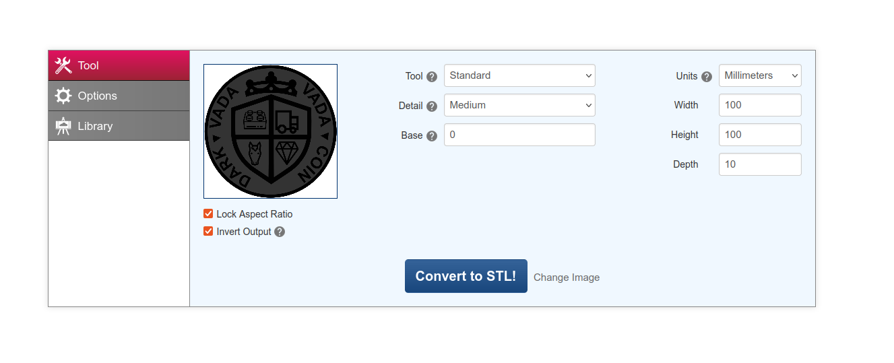
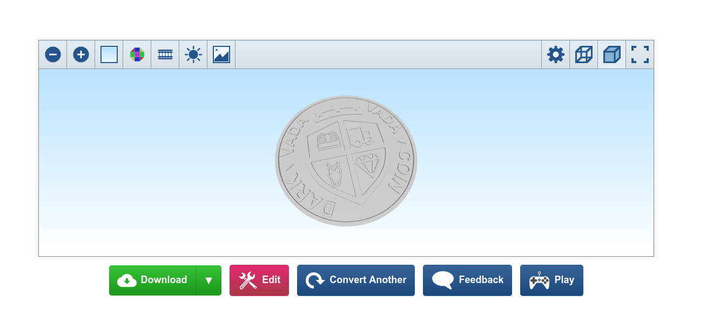

# Beautiful 3D STL coin generator

This project is still very WIP, but the idea is to create a simple generator that prompts the user for various choices to create a customized STL file to print a 3D coin using a 3D printer.

For now SVG to STL part is not yet implemented, only coin generator (to SVG)

Use https://imagetostl.com/convert/file/svg/to/stl for now (+ Invert Output option so that white is void, not the contrary)

## SVGs from

* https://www.svgrepo.com/vectors/lego/
* https://www.svgrepo.com/vectors/truck/
* https://www.svgrepo.com/vectors/crown/
* https://www.svgrepo.com/vectors/horse/
* https://svgsilh.com/tag/laurel-1.html